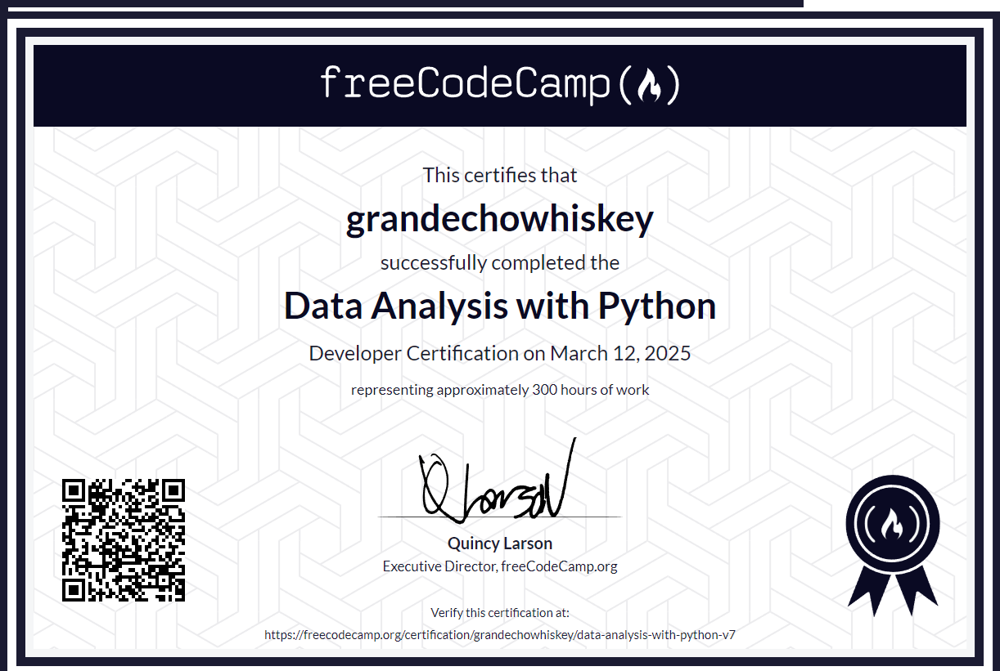

[<- Back to main](https://github.com/GrandEchoWhiskey)

<a href="https://www.freecodecamp.org/learn/data-analysis-with-python">
   
</a>

<h1 align="center">Data Analysis with Python</h1>

 

#### freeCodeCamp course on [freecodecamp.org/learn/data-analysis-with-python][fcc_link]
##### Certificate link: [click here][certificate_link]

---

## Projects:
Name | Description | Technology
:--- | :--- | :---:
[Mean-Variance-Standard Deviation Calculator][mean-variance-standard-deviation-calculator_link] | Computes mean, variance, and standard deviation from a 3x3 matrix | [![Python][py_img]](#)
[Demographic Data Analyzer][demographic-data-analyzer_link] | Analyzes census data to extract insights about different demographic groups | [![Python][py_img]](#)
[Medical Data Visualizer][medical-data-visualizer_link] | Visualizes health indicators like BMI, cholesterol, and disease correlation | [![Python][py_img]](#)
[Page View Time Series Visualizer][page-view-time-series-visualizer_link] | Analyzes and visualizes website page views over time | [![Python][py_img]](#)
[Sea Level Predictor][proj-5-sea-level-predictor_link] | Predicts future sea levels based on historical data using regression models | [![Python][py_img]](#)

  
---

<!-- Links -->

[fcc_link]: https://www.freecodecamp.org/learn/data-analysis-with-python
[certificate_link]: https://www.freecodecamp.org/certification/grandechowhiskey/data-analysis-with-python-v7

[mean-variance-standard-deviation-calculator_link]:     proj-1-mean-variance-standard-deviation-calculator
[demographic-data-analyzer_link]:                       proj-2-demographic-data-analyzer
[medical-data-visualizer_link]:                         proj-3-medical-data-visualizer
[page-view-time-series-visualizer_link]:                proj-4-page-view-time-series-visualizer
[proj-5-sea-level-predictor_link]:                      proj-5-sea-level-predictor

[py_img]: https://github.com/GrandEchoWhiskey/grandechowhiskey/blob/main/icons/programming/python.png